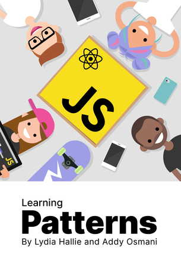

# Design Pattern Study

  

> "Give me some Cool Quote bout Design Patterns :)"

## 🚧 규칙

1. 본 스터디는 **강제성을 띠지 않으며 자율로 진행**한다.
2. 스터디 참가자는 각자 각 주에 해당하는 디자인 패턴을 공부한다.
3. 스터디 참가자는 각자 공부한 내용을 바탕으로 `JS` 혹은 `TS` 예제 코드를 작성하여 공유하는 것을 기본으로 한다.
4. 그 외의 언어로 공부한 예제 코드는 추가로 공유할 수 있다.
5. 주 1회 자신이 준비한 예제 코드를 공유하는 모임을 한다.
6. 예제들을 공유할 때 **꼭 코드 리뷰를 진행**하며 서로의 의견을 듣는다.

## 📝 학습자료
[Learning Patterns - Addy Osmani and Lydia Hallie](https://www.patterns.dev/book)

## 🖐 참여자

| 참가자 이름 |   Github 프로필  |  정리 자료  |
| :---------: | :-------------: | :-------------------: | 
| 김리하 | [bravacoreana](https://github.com/bravacoreana) | [:link:](bravacoreana/README.md) |
| 김민수 | [alstn2468](https://github.com/alstn2468) |  [:link:](alstn2468/README.md)  |
| 김우리 | [woori3104](https://github.com/woori3104) | [:link:](woori3104/README.md) |
| 성현제 | [hyunjaesung](https://github.com/hyunjaesung) | [:link:](hyunjaesung/README.md) |
| 이우림 | [ForestLee0513](https://github.com/ForestLee0513) | [:link:](ForestLee0513/README.md) |
| 정진우 | [bugoverdose](https://github.com/bugoverdose) | [:link:](bugoverdose/README.md) |
| 조성빈 | [chobobdev](https://github.com/chobobdev) | [:link:](chobobdev/README.md) |
| Henry | [devgony](https://github.com/devgony) | [:link:](devgony/README.md) |

Written by <a href="https://github.com/chobobdev">@Seongbin Cho</a><small>🍕</small>

