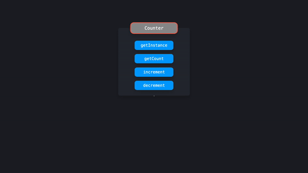
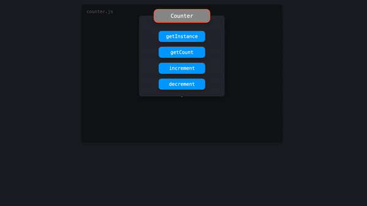

# Singleton Pattern (싱글톤 패턴)

> 애플리케이션 전체에서 하나의 글로벌 인스턴스를 공유하는 패턴

싱글톤은 한 번 인스턴스화 할 수 있고 전역으로 접근할 수 있는 클래스입니다. 이 *단일 인스턴스*는 애플리케이션 전체에서 공유할 수 있음으로 싱글톤은 애플리케이션의 글로벌 상태를 관리하는 데 유용합니다.

먼저 ES2015 클래스를 사용하는 싱글톤에 대해 살펴보겠습니다. 예시에서는 아래의 기능을 포함하는 `Counter` 클래스를 만들어보겠습니다.

- `getInstance` : 인스턴스의 값을 반환하는 메서드
- `getCount` : `counter` 변수의 현재 값을 반환하는 메서드
- `increment` : `counter` 값을 1씩 증가시키는 메서드
- `decrement` : `counter` 값을 1씩 감소시키는 메서드

```typescript
let counter = 0;

class Counter {
  getInstance() {
    return this;
  }

  getCount() {
    return counter;
  }

  increment() {
    return ++counter;
  }

  decrement() {
    return --counter;
  }
}
```

하지만 이 클래스는 싱글톤 기준에 맞지 않습니다. 싱글톤은 **한 번만 인스턴스화** 할 수 있습니다. 지금은 `Counter` 클래스의 인스턴스를 여러 개 만들 수 있습니다.

```typescript
let counter = 0;

class Counter {
  getInstance() {
    return this;
  }

  getCount() {
    return counter;
  }

  increment() {
    return ++counter;
  }

  decrement() {
    return --counter;
  }
}

const counter1 = new Counter();
const counter2 = new Counter();

console.log(
  counter1.getInstance() === counter2.getInstance()
); // false
```

새로운 메소드를 두 번 호출함으로써, 단지 `counter1`과 `counter2`를 서로 다른 인스턴스로 설정합니다. `counter1`과 `counter2`의 `getInstance` 메서드에 의해 반환된 값은 서로 다른 인스턴스에 대한 참조를 효과적으로 반환했습니다. 즉, 두 인스턴스의 값이 완전히 동일하지는 않습니다.



`Counter` 클래스의 인스턴스를 **하나만** 만들 수 있도록 확인할 수 있습니다.

인스턴스를 하나만 만들 수 있는 한 가지 방법은 `instance`라는 변수를 만드는 것입니다. 새 인스턴스가 생성될 때 `Counter` 생성자에서 `instance`의 참조와 동일하게 설정할 수 있습니다. `instance` 변수가 이미 값을 가졌는지 확인하여 새로운 인스턴스가 생기는 것을 방지할 수 있습니다. 그런 경우라면 이미 인스턴스가 존재하는 것입니다. 그런 일은 생기지 않아야 하며 사용자에게 알리기 위해 오류가 발생해야 합니다.

```typescript
let instance;
let counter = 0;

class Counter {
  constructor() {
    if (instance) {
      throw new Error('You can only create one instance!');
    }
    instance = this;
  }

  getInstance() {
    return this;
  }

  getCount() {
    return counter;
  }

  increment() {
    return ++counter;
  }

  decrement() {
    return --counter;
  }
}

const counter1 = new Counter();
const counter2 = new Counter();
// Error: You can only create one instance!
```

완벽합니다! 더 이상 여러개의 인스턴스를 만들 수 없습니다.

`counter.js` 파일에서 `Counter` 인스턴스를 export 합니다. 하지만 그전에 인스턴스를 얼려야(**freeze**) 합니다. `Object.freeze` 메서드는 코드를 사용하는 것이 싱글톤을 수정할 수 없도록 합니다. 고정된 인스턴스의 속성을 추가하거나 수정할 수 없으므로 싱글톤의 값을 실수로 덮어쓸 위험이 줄어듭니다.

```typescript
let instance;
let counter = 0;

class Counter {
  constructor() {
    if (instance) {
      throw new Error('You can only create one instance!');
    }
    instance = this;
  }

  getInstance() {
    return this;
  }

  getCount() {
    return counter;
  }

  increment() {
    return ++counter;
  }

  decrement() {
    return --counter;
  }
}

const singletonCounter = Object.freeze(new Counter());
export default singletonCounter;
```

<hr />

`Counter` 예시를 구현하는 애플리케이션을 살펴보겠습니다. 아래와 같은 파일이 있습니다.

- `counter.js` : `Counter` 클래스를 포함하고 **Counter 인스턴스**를 기본 내보내기로 내보냅니다.
- `index.js` : `redButton.js`와 `blueButton.js` 모듈을 불러옵니다.
- `redButton.js` : `Counter`를 가져와 **빨간색** 버튼에 이벤트 리스너로 `Counter`의 `increment` 메서드를 추가하고 `getCount` 메서드를 호출해 카운터의 현재 값을 기록합니다.
- `blueButton.js` : `Counter`를 가져와 **파란색** 버튼에 이벤트 리스너로 `Counter`의 `increment` 메서드를 추가하고 `getCount` 메서드를 호출하여 카운터의 현재 값을 기록합니다.

`blueButton.js`와 `redButton.js`는 모두 `counter.js`에서 **동일한 인스턴스**를 가져옵니다. 이 인스턴스는 두 파일 모두에서 **Counter**로 가져옵니다.



`redButton.js` 또는 `blueButton.js`에서 `increment` 메서드를 호출하면 `Counter` 인스턴스의 `counter` 속성 값이 두 파일 모두에서 업데이트됩니다. 빨간색 버튼을 클릭하든 파란색 버튼을 클릭하든 상관 없습니다. 모든 인스턴스에서 동일한 값이 공유됩니다. 이것이 다른 파일에서 메소드를 호출하고 있음에도 불구하고 `counter`가 계속 1씩 증가하는 이유입니다.

<hr />

## 장단점

인스턴스를 생성하는 것을 하나의 인스턴스로만 제한하면 잠재적으로 많은 메모리 공간을 절약할 수 있습니다. 매번 새 인스턴스에 대한 메모리를 설정할 필요 없이 애플리케이션 전체에서 참조되는 한 인스턴스에 대한 메모리만 설정하면 됩니다. 그러나 싱글톤은 실제로 **안티 패턴**으로 간주될 수 있습니다. 따라서 JavaScript에서는 피해야 합니다.

자바나 C++와 같은 많은 프로그래밍 언어에서는 JavaScript에서 할 수 있는 방식으로 객체를 직접 생성할 수 없습니다. 이러한 객체 지향 언어에서 우리는 객체를 만드는 클래스를 만들어야 합니다. 생성된 객체는 JavaScript 예시의 `instance` 값과 마찬가지로 클래스의 인스턴스 값을 가집니다.

그러나 위의 예시에 나타난 클래스 구현은 사실 과합니다. JavaScript에서 객체를 직접 만들 수 있기 때문에 일반 객체를 사용하여 동일한 결과를 얻을 수 있습니다. 싱글톤을 사용할 때의 몇 가지 단점에 대해 알아보겠습니다.

#### 일반 객체를 사용할 때

앞에서 본 것과 같은 예시를 사용합니다. 그러나 이번에는 `counter`는 단순하게 아래를 포함하는 객체입니다.

- `count` 속성
- `increment` : `count` 값을 1씩 증가시키는 메서드
- `decrement` : `count` 값을 1씩 감소시키는 메서드

```typescript
let count = 0;

const counter = {
  increment() {
    return ++count;
  },
  decrement() {
    return --count;
  },
};

Object.freeze(counter);
export { counter };
```

객체가 참조에 의해 전달되기 때문에 `redButton.js`와 `blueButton.js`는 모두 동일한 `singletonCounter` 객체에 대한 참조를 가져옵니다. 두 파일 중 하나에서 카운트 값을 수정하면 `singletonCounter`의 값이 수정되며, 이 값은 두 파일에 모두 표시됩니다.

### 테스트하기

싱글톤에 의존하는 코드를 테스트하는 것은 까다로울 수 있습니다. 매번 새로운 인스턴스를 만들 수 없기 때문에 모든 테스트는 이전 테스트의 인스턴스를 수정하는 데 의존합니다. 이 경우 테스트 순서는 중요하며, 한 번의 작은 수정으로 전체 테스트 케이스가 실패할 수 있습니다. 테스트 후, 테스트를 통해 수정한 내용을 초기화하기 위해 전체 인스턴스를 초기화해야 합니다.

```typescript
import Counter from "../src/counter";

test("incrementing 1 time should be 1", () => {
  Counter.increment();
  expect(Counter.getCount()).toBe(1);
});

test("incrementing 3 extra times should be 4", () => {
  Counter.increment();
  Counter.increment();
  Counter.increment();
  expect(Counter.getCount()).toBe(4);
});

test("decrementing 1  times should be 3", () => {
  Counter.decrement();
  expect(Counter.getCount()).toBe(3);
});
```

#### 의존성 숨기기

다른 모듈인 `superCounter.js`를 가져올 때 해당 모듈이 싱글톤을 가져오는 것이 분명하지 않을 수 있습니다. 이 경우 `index.js`와 같은 다른 파일에서는 해당 모듈을 가져와 메서드를 호출할 수 있습니다. 이러한 방식으로 싱글톤의 값을 실수로 수정할 수 있습니다. 이것은 예상치 못한 동작으로 이어질 수 있습니다. 이것은 싱글톤의 인스턴스를 애플리케이션 전체에 걸쳐 공유할 수 있기 때문입니다.

```typescript
import Counter from "./counter";

export default class SuperCounter {
  constructor() {
    this.count = 0;
  }

  increment() {
    Counter.increment();
    return (this.count += 100);
  }

  decrement() {
    Counter.decrement();
    return (this.count -= 100);
  }
}
```

### 전역적인 동작

싱글톤 인스턴스는 전체 애플리케이션에서 참조될 수 있어야 합니다. 전역 변수는 기본적으로 동일한 동작을 보여줍니다. 전역 변수를 전역 범위에서 사용할 수 있으므로 애플리케이션 전체에서 전역 변수에 접근할 수 있습니다.

전역 변수를 갖는 것은 일반적으로 잘못된 설계로 간주됩니다. 전역 범위 오염은 전역 변수의 값을 실수로 덮어쓰는 결과를 만들 수 있으며, 이것은 예상치 못한 동작을 발생시킬 수 있습니다.

ES2015에서 전역 변수를 생성하는 것은 매우 드문 일입니다. 새로운 `let`과 `const` 키워드는 개발자가 이 두 키워드로 선언된 변수를 블록 범위로 유지하여 실수로 글로벌 범위를 오염시키는 것을 방지합니다. 자바스크립트의 새로운 모듈 시스템은 모듈로부터 값을 `export`하고 다른 파일에 값을 `import`할 수 있기 때문에 전역 범위를 오염시키지 않고 전역으로 접근 가능한 값을 쉽게 만들 수 있습니다.

그러나 싱글톤의 일반적인 사용 사례는 프로그램 전체에 일종의 **전역 상태**를 갖는 것입니다. 코드의 여러 부분이 동일한 **변경 가능한 객체**에 의존하면 예상하지 못한 동작이 발생할 수 있습니다.

일반적으로 코드의 특정 부분은 전역 상태 내의 값을 수정하는 반면 다른 부분은 해당 데이터를 사용합니다. 여기서 실행 순서는 중요합니다. 사용할 데이터가 없는 상황에서 실수로 먼저 데이터를 사용해서는 안 됩니다. 전역 상태를 사용할 때 데이터 흐름을 이해하는 것은 애플리케이션이 커질수록 매우 까다로워질 수 있으며 수십 개의 컴포넌트가 서로 의존합니다.

### React에서의 상태 관리

React에서는 싱글톤을 사용하는 대신 **Redux** 또는 **React Context**와 같은 상태 관리 도구를 통해 전역 상태에 의존하는 경우가 많습니다. 이들의 전역 상태 동작은 싱글톤의 동작과 비슷해 보일 수 있지만, 이러한 도구들은 싱글톤의 변경 가능한 상태가 아닌 **읽기 전용 상태**를 제공합니다. Redux를 사용할 때, 컴포넌트가 `dispatcher`를 통해 `action`을 전송한 후에는 순수 함수 `reducer`만 상태를 업데이트할 수 있습니다.

이런 도구를 사용하면 전역 상태를 갖는 것의 단점이 마법처럼 사라지지는 않지만, 컴포넌트가 상태를 직접 업데이트할 수 없기 때문에 적어도 전역 상태를 의도하는 대로 변경할 수 있습니다.

<hr />

### 참고

- [Do React Hooks replace Redux - Eric Elliott](https://medium.com/javascript-scene/do-react-hooks-replace-redux-210bab340672)
- [Working with Singletons in JavaScript - Vijay Prasanna](https://www.digitalocean.com/community/tutorials/js-js-singletons)
- [JavaScript Design Patterns: The Singleton - Samier Saeed](https://www.sitepoint.com/javascript-design-patterns-singleton/)
- [Singleton - Refactoring Guru](https://refactoring.guru/design-patterns/singleton)