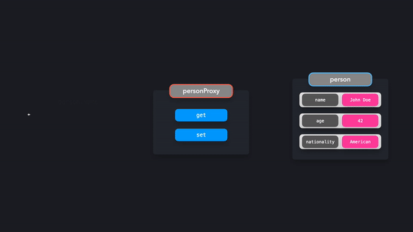

# Proxy Pattern (프록시 패턴)

> 대상 객체에 대한 상호 작용 차단 및 제어

Proxy 객체를 사용하면 특정 객체와의 상호 작용을 효과적으로 제어할 수 있습니다. Proxy 객체는 객체와 상호 작용할 때마다(예: 값을 가져오거나 값을 설정할 때) 동작을 결정할 수 있습니다.

<hr />

일반적으로, Proxy는 대신하는 것을 의미합니다. 대상에게 직접 말하는 대신 당신이 말하려고 했던 사람의 대리인과 이야기하게 됩니다. JavaScript에서도 마찬가지로 대상 객체와 직접 상호 작용하는 대신 Proxy 객체와 상호 작용합니다.

<hr />

John Doe를 나타내는 `person` 객체를 작성합니다.

```typescript
const person = {
  name: 'John Doe',
  age: 42,
  nationality: 'American'
};
```

우리는 객체와 직접 상호작용하는 대신에 Proxy 객체와 상호작용하기를 원합니다. JavaScript에서는 `Proxy` 인스턴스를 생성함으로써 쉽게 새로운 Proxy 객체를 생성할 수 있습니다.

```typescript
const person = {
  name: 'John Doe',
  age: 42,
  nationality: 'American'
};

const personProxy = new Proxy(person, {});
```

**Proxy**의 두 번째 인자는 `handler`를 나타내는 객체입니다. 핸들러 객체에서 상호 작용 타입을 기반으로 특정 동작을 정의할 수 있습니다. Proxy 핸들러에 추가할 수 있는 **여러 가지 방법**이 있지만 가장 일반적인 두 가지 방법은 `get`과 `set`입니다.

- `get` : 속성에 **접근**하려고 할 때 호출됩니다.
- `set` : 속성을 **수정**하려고 할 때 호출됩니다.

결과적으로 아래와 같은 결과를 확인할 수 있습니다.



